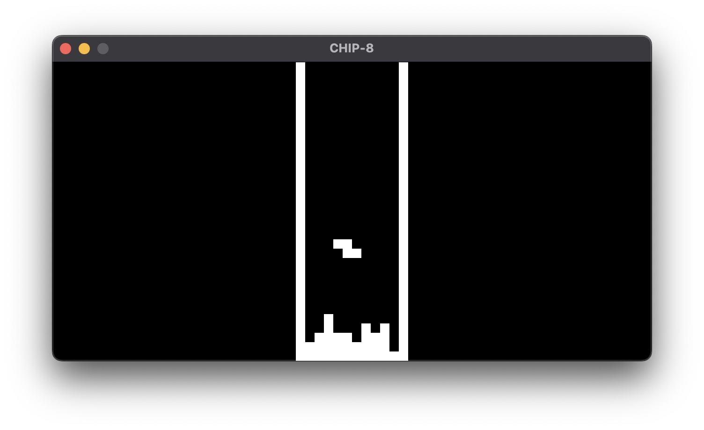
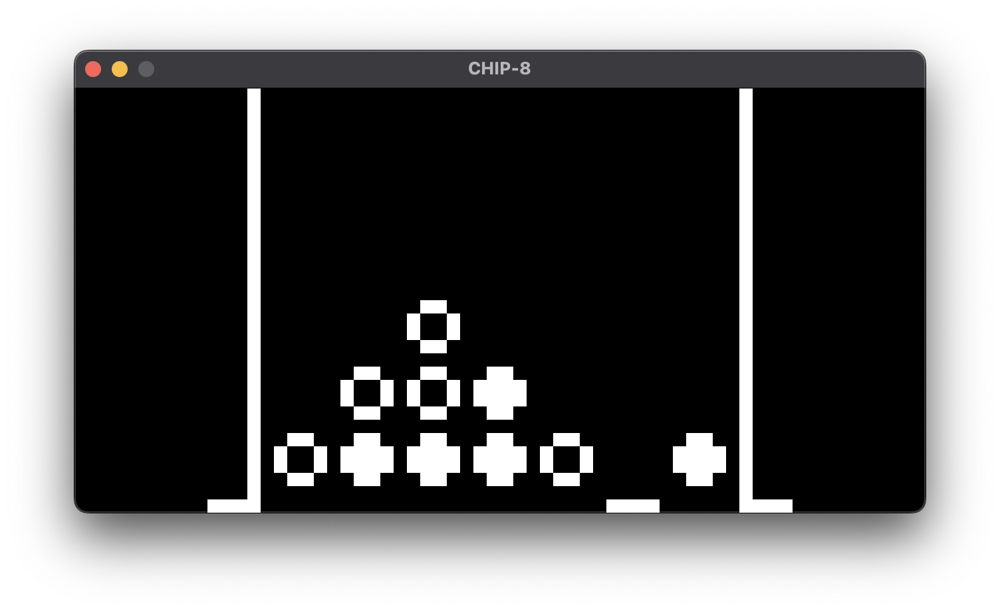
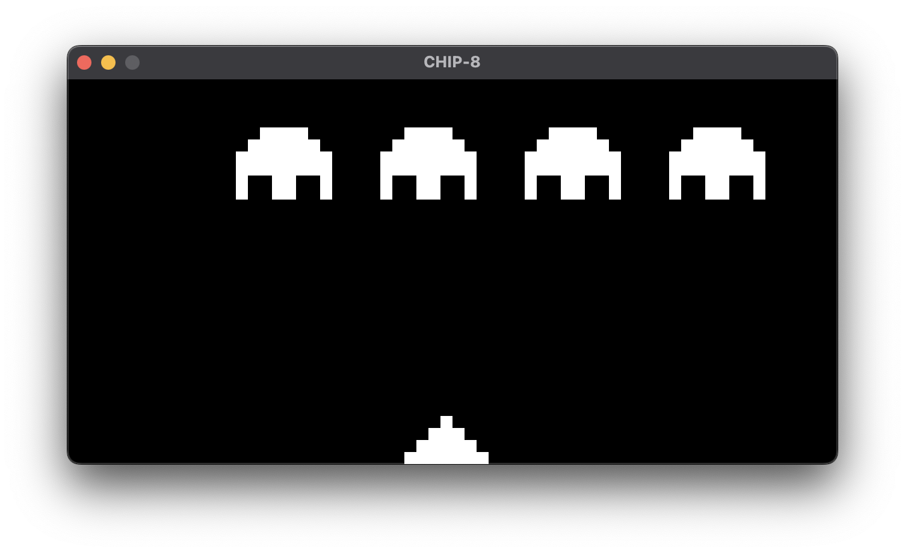

# 🤖 chipper – the friendly CHIP-8 interpreter

Chipper is a minimal and robust CHIP-8 interpreter written in Rust, featuring accurate emulation, configurable settings, and a clean graphical interface. It provides a platform for running classic CHIP-8 games and programs with high compatibility.

## Features

- Complete implementation of all CHIP-8 instructions
- 60Hz timer system for accurate game speed
- Configurable emulation settings
- Built-in debugger with operation printing
- Minimal GUI using WGPU, with a WIP experimental GPUI backend
- Support for original CHIP-8 ROMs
- Sound support
- Included ROM collection with games, demos and test programs
- Tests for all core functionality, including every opcode

> Future plans include using the experimental GPUI backend to provide a GUI that makes it easier to debug programs, with the ability to inspect the internal state of the interpreter, and manually control the execution of programs.

## Getting Started

### Prerequisites

- Rust toolchain (latest stable version)
- A compatible OS with graphics support

> [!WARNING]
> The scancodes used for the keypad have only been tested on macOS, making macOS the only official supported OS right now. I would like to improve this once I have more time to work on the project.

### Building

```bash
cargo build --bin chipper-wgpu --release
```

The executable will be available in `target/release/`.

### Running ROMs

To run a ROM:

```bash
cargo run --bin chipper-wgpu --release -- --load path/to/rom.ch8
```

## Controls

The CHIP-8 uses a 16-key hexadecimal keypad. These keys are mapped to your keyboard as follows:

```
Original CHIP-8    Keyboard
+---+---+---+---+  +---+---+---+---+
| 1 | 2 | 3 | C |  | 1 | 2 | 3 | 4 |
+---+---+---+---+  +---+---+---+---+
| 4 | 5 | 6 | D |  | Q | W | E | R |
+---+---+---+---+  +---+---+---+---+
| 7 | 8 | 9 | E |  | A | S | D | F |
+---+---+---+---+  +---+---+---+---+
| A | 0 | B | F |  | Z | X | C | V |
+---+---+---+---+  +---+---+---+---+
```

## Included ROMs

The `roms/` directory contains a curated collection of CHIP-8 programs:

- Games: Classic titles like Pong, Tetris, Space Invaders
- Demos: Visual demonstrations and effects
- Test Programs: ROMs for testing emulator accuracy

## Technical Details

- Display: 64x32 pixel monochrome display
- Memory: 4KB (4096 bytes)
- Registers: 16 8-bit general purpose registers (V0-VF)
- Stack: 16 16-bit values
- Timers: Delay and sound timers operating at 60Hz
- Input: 16-key hexadecimal keypad

## Configuration

Chipper supports several configuration options for compatibility, which are available through CLI arguments:

- Legacy shift behavior
- Memory load/store increment behavior
- Jump with offset behavior
- Operations per cycle
- Debug output

For more info, run the binary with the `--help` argument.

## Project Structure

- `chipper-core/`: Core emulator implementation
- `chipper-wgpu/`: WGPU graphics rendering backend
- `chipper-gpui/`: Experimental GPUI graphics rendering backend
- `roms/`: Collection of CHIP-8 programs

## Screenshots







## License

Licensed under either of:

- Apache License, Version 2.0 ([LICENSE-APACHE] or https://www.apache.org/licenses/LICENSE-2.0)
- MIT license ([LICENSE-MIT] or https://opensource.org/licenses/MIT)

at your option.

Unless you explicitly state otherwise, any contribution intentionally submitted for inclusion in the work by you shall be dual licensed as above, without any additional terms or conditions.

## Contributing

Contributions are welcome! Please feel free to create an Issue or submit a Pull Request.

## Acknowledgments

- Thanks to the CHIP-8 community for ROMs and documentation
- Special thanks to ROM authors who have allowed redistribution of their work
- Special thanks to Tobias V. Langhoff, who's high-level guide to making a CHIP-8 emulator was invaluable

## Resources

- Tobias V. Langhoff High Level Guide – https://tobiasvl.github.io/blog/write-a-chip-8-emulator/
- Cowgod's CHIP-8 Technical Reference – http://devernay.free.fr/hacks/chip8/C8TECH10.HTM
- The collection of ROMs – https://github.com/kripod/chip8-roms

[//]: # "general links"
[LICENSE-APACHE]: https://github.com/felixpackard/chipper/blob/master/LICENSE-APACHE
[LICENSE-MIT]: https://github.com/felixpackard/chipper/blob/master/LICENSE-MIT
